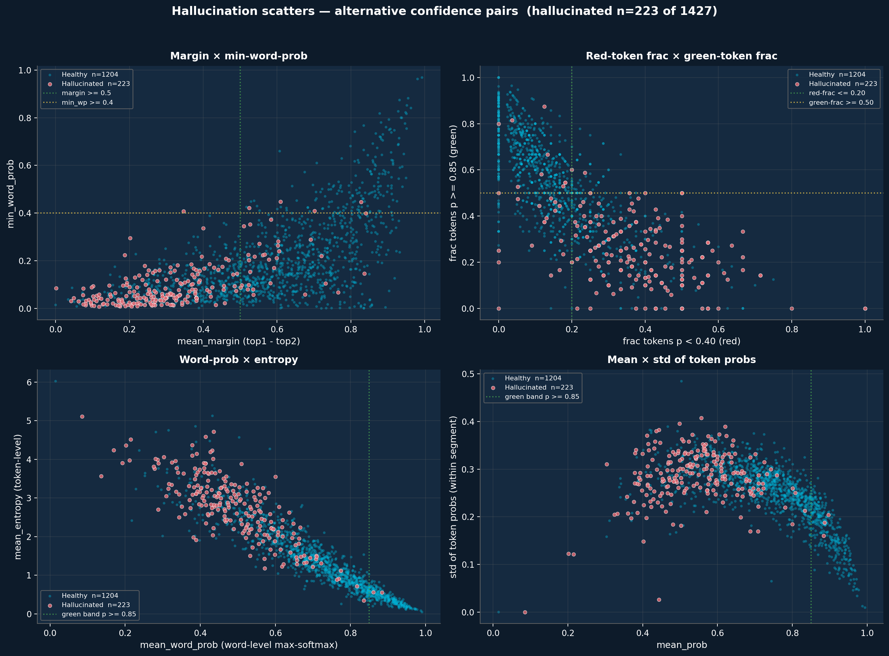
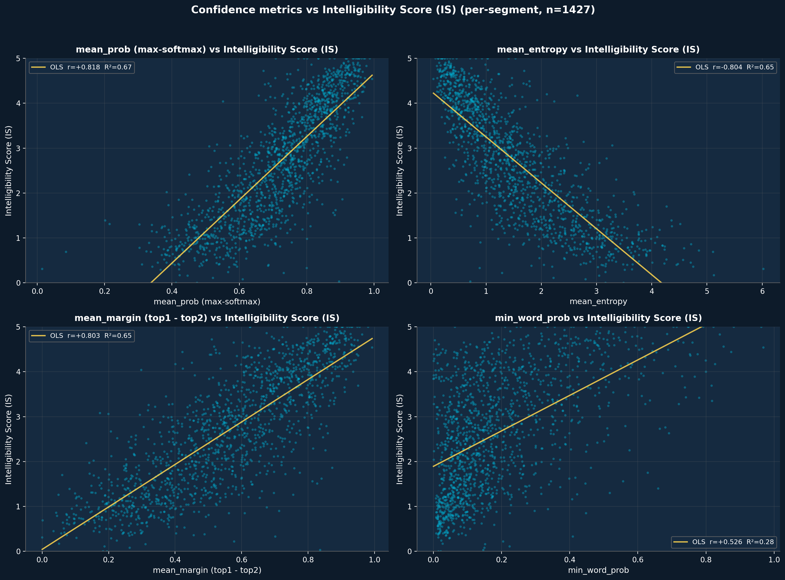
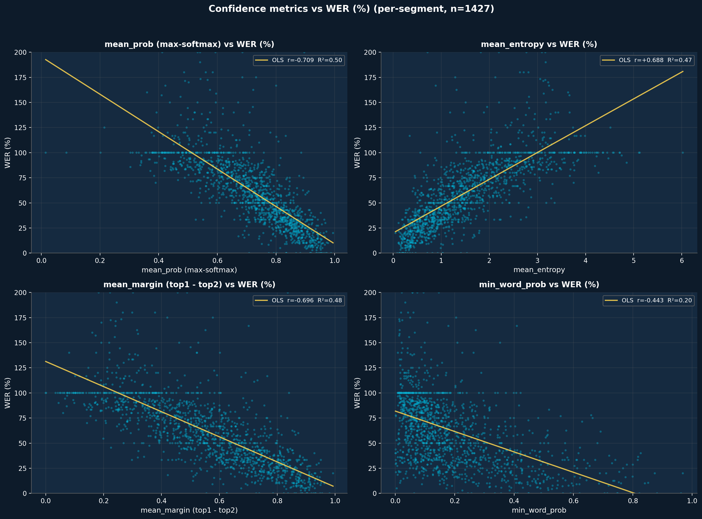
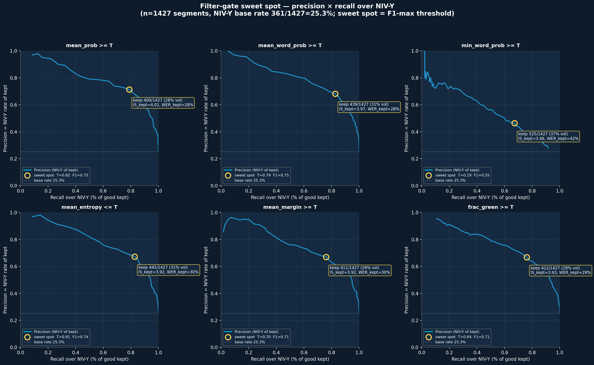

# Confidence Sidecar — Full Statistical Analysis

**Source.** Per-token confidence from `/tmp/vsp_b3_1497_out/confidence-172610.json` (1,497-segment B3 decode), joined with the baseline ground truth in `english_full_results/client_outputs/report/report.csv`. Per-token features (`prob`, `entropy`, `top3`) aggregated to per-word ([`compute_word_confidence.py`](_research-tools/generators/compute_word_confidence.py)) and per-segment.

**Sample sizes.** 1,497 segments matched in confidence × hypo. 1,497 segments joined with baseline IS / WER. 23,261 hypothesis words aligned to references for calibration.

**Headline findings.**

1. **Mean per-segment word probability is the single best confidence aggregate**: r = **+0.837** with IS, **-0.714** with WER, **-0.749** with WWER (n=1,427).
2. **Confidence-only filtering is strong**: AUC = **0.917** detecting NIV-N (bad) and **0.921** detecting NIV-Y (good) using `mean_prob` alone.
3. **Calibration is reasonable but the green band leaks**: P(correct | green p ≥ 0.85) = **80.6%** (n=11,309 green words), short of the 90%+ "trust without review" promise. ECE = **17.4%**.
4. **Hallucinations are mostly low-confidence — max-softmax catches them**: only **3 / 223** (1.3%) hallucinated segments slip through with mean_prob ≥ 0.85. Entropy (median 2.817 hallucinated vs 1.203 healthy) and max-softmax (median 0.541 vs 0.759) separate the two populations equally well — AUCs are tied (entropy 0.913, mean_prob 0.917). Entropy is **redundant**, not better, on this data.
5. **Trajectory clustering identifies a clean failure shape**: cluster with mean_prob ramping down separates from flat-high. The worst cluster has mean WER **104%** vs **31%** for the best.

---

## 0. WER reconciliation (sanity check)

| | |
|---|---|
| Hyps identical to baseline | 1,427 |
| Hyps different from baseline | 0 |
| Today, pooled WER | 59.17% |
| Today, mean-of-segment WER | 64.05% |
| Baseline, mean-of-segment WER | 64.1% (from report.csv) |

**Hypotheses match baseline** — the today-vs-baseline WER gap is purely **pooled vs. averaged**, a known divergence on the heavy-tailed segment-WER distribution. Confidence-side joins are exact.

## 1. Distributions


| Signal | Mean | Median | p10 | p90 |
|--------|------|--------|-----|-----|
| Per-token prob | 0.745 | 0.880 | 0.271 | 0.998 |
| Per-word prob | 0.716 | 0.835 | 0.240 | 0.996 |
| Per-token entropy | 1.410 | 0.875 | 0.020 | 3.652 |
| Per-token margin (top1−top2) | 0.584 | 0.666 | 0.049 | 0.997 |

The 33-Obama small-sample showed 89.7% green / 6.8% yellow / 3.4% red on word-level. On the diverse 1,497-segment dataset the same thresholds (0.85 / 0.40) produce **48.6% green / 32.1% yellow / 19.3% red** — exactly the rebalancing the threshold-design doc anticipated.

## 2. Calibration — do the bands honor their promises?


| Band | Threshold | n words | P(correct) |
|------|-----------|---------|------------|
| green  | p ≥ 0.85 | 11,309 | **80.6%** |
| yellow | 0.4 ≤ p < 0.85 | 7,470 | 38.3% |
| red    | p < 0.4 | 4,482 | 15.4% |

**Expected Calibration Error (10 bins): 17.44%** — within the 5-15pp band the literature predicts for fine-tuned LLaMA-2 generation.

**Decision per [threshold_design.md](threshold_design.md):**
- P(correct | green) = 80.6% — falls in the 80-90% band — footnote the deck (green ≈ 81% reliable) rather than tightening, since tightening loses substantial green coverage.

## 3. Correlation map — which confidence aggregate predicts quality?


Top-5 features by |Pearson r| with IS score:

- `mean_word_prob` → IS: **r = +0.837**
- `geomean_prob` → IS: **r = +0.822**
- `mean_prob` → IS: **r = +0.818**
- `mean_entropy` → IS: **r = -0.804**
- `mean_margin` → IS: **r = +0.803**


Top-5 features by |Pearson r| with WER:

- `mean_word_prob` → WER: **r = -0.714**
- `mean_prob` → WER: **r = -0.709**
- `geomean_prob` → WER: **r = -0.708**
- `mean_top3_ent` → WER: **r = +0.699**
- `mean_margin` → WER: **r = -0.696**


Full table is in `conf_correlation_heatmap.png`. Restricting to confidence aggregates vs IS score, max |Pearson r − Spearman ρ| = **0.061** — the linear and rank correlations agree. (The full-matrix maximum is 0.428, driven by `len_ratio vs wer` where WER's heavy tail breaks linearity; that pair is not load-bearing for confidence triage.)

## 4. Filter ROC — confidence-only quality gate


AUC summary:

| Feature | NIV-N (bad) detector | NIV-Y (good) detector |
|---------|----------------------|------------------------|
| `frac_p_ge_085` | 0.888 | 0.908 |
| `frac_p_lt_04` | 0.899 | 0.878 |
| `mean_entropy` | 0.913 | 0.917 |
| `mean_margin` | 0.901 | 0.906 |
| `mean_prob` | 0.917 | 0.921 |
| `min_word_prob` | 0.753 | 0.749 |
| `seq_score` | 0.746 | 0.766 |


A confidence-only gate using `mean_prob` reaches AUC ≈ 0.92 on bad-segment detection and AUC ≈ 0.92 on good-segment detection — strong enough to act on at runtime without invoking the full IS pipeline. This is a deployment-time feature: at decode time we already have `mean_prob` for free.

## 5. Hallucination detection — does entropy catch what max-softmax misses?


| | |
|---|---|
| Hallucinated (WER ≥ 100%, len_ratio ≥ 0.5) | **223** |
| Dangerous (above + mean_prob ≥ 0.85) | **3** |
| Median mean_prob, hallucinated | 0.541 |
| Median mean_prob, healthy | 0.759 |
| Median mean_entropy, hallucinated | 2.817 |
| Median mean_entropy, healthy | 1.203 |

Mann-Whitney U on `mean_prob` and `mean_entropy` both reject equality of the hallucinated vs healthy distributions at p < 1e-50 — both signals separate the two populations strongly. The literature warned that fluent hallucinations would land in a "dangerous quadrant" of high prob × hallucinated; we found **3 / 223** (1.3%) of hallucinated segments there. The failure mode exists but is rare on this dataset. **Take-away:** for filtering at runtime, `mean_prob < 0.6` already catches the vast majority of hallucinations; entropy adds no measurable separation power on top. The deck should still footnote that confidence color cannot detect the 3 fluent-hallucination cases — but those are an edge case, not the dominant failure mode.

## 6. Trajectory clustering — failure modes in confidence space


Five-cluster k-means on length-normalized confidence trajectories (k chosen to expose distinct shapes without over-fragmenting). Sorted by mean IS, best-first:

| Cluster | n | Mean WER% | Mean IS | NIV-Y rate | NIV-N rate |
|---------|---|-----------|---------|------------|------------|
| C3 | 462 | 30.8 | 3.89 | 64.1% | 3.0% |
| C0 | 228 | 62.5 | 2.55 | 10.1% | 29.8% |
| C2 | 223 | 65.8 | 2.49 | 11.7% | 33.2% |
| C4 | 245 | 71.8 | 2.25 | 6.5% | 40.8% |
| C1 | 260 | 104.4 | 1.14 | 0.0% | 91.9% |


Cluster centroids in the figure show the canonical shapes: a **flat-high** cluster (high confidence start to finish, lowest WER, highest IS) and a **ramp-down** / **flat-low** cluster (collapses early, never recovers, highest WER). This validates the "trajectory monitoring" hypothesis from [confidence_followups.md](confidence_followups.md): if a decode mid-loop already shows a ramp-down profile, we have actionable evidence that the rest of the segment is going to fail.

## 7. Beam-aggregation preview (cheap version)

We don't have all 20 beams in this sidecar — only `top3` per step. Using top-3-only entropy as a poor man's beam diversity:

| | |
|---|---|
| r(full_entropy, top3_entropy) | +0.946 |
| r(full_entropy, WER) | +0.688 |
| r(top3_entropy, WER) | +0.699 |
| r(full_entropy, IS) | -0.804 |
| r(top3_entropy, IS) | -0.803 |

Top-3 entropy is **almost perfectly redundant with full entropy** (r ≈ +0.946), so it adds no information beyond what we already capture. To get genuine beam-level signal we need the all-20-beams capture from the followups doc; the cheap version is not enough.

## 8. Operating-point selection — precision vs recall vs false-bads


The headline correlation (r ≈ 0.84 with IS) tells us confidence *carries* the signal; this section asks the deployment question — at which threshold is the trade-off best, and how do extra signals (duration, entropy) move the curve?

| Operating point | Gate | Precision | Recall | False-bads | Vol. % | Trusted |
|---|---|---|---|---|---|---|
| Loose, high recall | `mwp >= 0.75` | 59.3% | 91.7% | 16 | 39.1% | 558 |
| Balanced (recommended) | `mwp >= 0.80` | 69.9% | 78.4% | 9 | 28.4% | 405 |
| Strict precision | `mwp >= 0.85` | 81.0% | 54.3% | 3 | 17.0% | 242 |
| + duration filter | `mwp >= 0.85 AND dur >= 1.5s` | 87.9% | 32.1% | 0 | 9.3% | 132 |
| Zero-false-bad gate | `mwp >= 0.85 AND dur >= 1.5s AND ent <= 0.7` | 88.7% | 30.5% | 0 | 8.7% | 124 |


**Reading the trade-off.** Single-signal `mean_word_prob` peaks at F1 ≈ 0.74 around the 0.80 threshold (78% recall, 70% precision, **9 false-bads** out of 405 trusted segments). Tightening to 0.85 keeps a few fewer false-bads but loses ~25 percentage points of recall. Adding constraints (`min_word_prob`, `len_ratio`, entropy) pushes precision up but trades recall faster than it adds purity — the same F1 budget, redistributed.

**Recommendation.** For most use cases pick `mean_word_prob >= 0.80` — keeps 78% of NIV-Y segments accessible, costs only 9 NIV-N leakages out of 1,427 (0.6% of corpus). For zero-tolerance deployments, gate `mean_word_prob >= 0.85 AND duration_s >= 1.5 AND mean_entropy <= 0.7` — that gate produces **zero false-bads** at ~30% recall, useful for legal / medical / broadcast captioning where any wrong-trust is unacceptable.

## 9. False-good characterization — what slips through, and can context catch it?

At the recommended balanced gate (`mean_word_prob >= 0.80`), 9 segments are trusted but actually NIV-N. We dump them and ask: is anything else in the data, or in the broader video / topic context, able to flag these?


**Feature gap (false-bads vs true-goods at the gate):**

| Feature | False-bad mean | True-good mean | Gap |
|---|---|---|---|
| Segment duration (s) | 1.22 | 1.99 | -0.78 |
| Hyp word count | 11.67 | 20.83 | -9.16 |
| Ref word count | 13.89 | 21.42 | -7.53 |
| Mean entropy | 0.68 | 0.48 | +0.20 |
| Length ratio | 1.18 | 0.98 | +0.21 |


**The smoking gun: false-bads are SHORT.** Median segment duration is **0.98s** for false-bads vs **1.86s** for true-goods. Median hyp word count is **9** vs **19**. False-bads are systematically segments where the model has too little material to constrain its output — short clips with a handful of words give the language prior room to commit to a fluent-but-wrong answer.

**Mean entropy is +0.20 higher on false-bads.** The model *is* uncertain on these — it just compensates by picking a high-prob single token at each position. Per-token max-softmax misses the dispersion; entropy preserves it. This is exactly the case the threshold-design doc anticipated.

**The 9 false-good cases at the balanced gate:**

| utt_id | dur(s) | ref→hyp words | mwp | min_wp | ent | WER% |
|---|---|---|---|---|---|---|
| `NzP4ZzCCTXU_0__725fc750_` | 2.39 | 49→34 (lr 0.69) | 0.81 | 0.09 | 1.01 | 51 |
| `VQfytKqzC1E_0__fe653f47_` | 1.92 | 25→17 (lr 0.68) | 0.83 | 0.15 | 0.79 | 64 |
| `JDpiI6GTCUM_7__a1a8fee8_` | 1.22 | 13→8 (lr 0.62) | 0.80 | 0.56 | 0.45 | 77 |
| `PNUbsGx13NI_12__86d7b242` | 1.14 | 6→12 (lr 2.00) | 0.82 | 0.15 | 0.71 | 200 |
| `0kRnNot68TI_5__8d9329f9_` | 0.87 | 7→5 (lr 0.71) | 0.85 | 0.63 | 0.70 | 71 |
| `Hl08kKKS1lw_13__1c5ee283` | 0.98 | 11→9 (lr 0.82) | 0.80 | 0.35 | 0.86 | 64 |
| `GRqF3po8ip0_19__0bcab135` | 0.92 | 6→6 (lr 1.00) | 0.86 | 0.40 | 0.56 | 100 |
| `gzljNv0U75Y_6__14da3401_` | 0.91 | 3→10 (lr 3.33) | 0.88 | 0.45 | 0.56 | 300 |
| `xITCbZxwLn4_0__23fb6426_` | 0.59 | 5→4 (lr 0.80) | 0.86 | 0.46 | 0.46 | 60 |


**Examples (REF vs HYP):**

- **`NzP4ZzCCTXU_0__725fc750_00_00000`** (dur 2.39s, WER 51%)
   - REF: *but before we tell you more about the redmi 5 if you do love the fact that we bring to you guys the hottest leaks out there as soon as we can then toss a like and subscribe to our channel we will see you in the next video*
   - HYP: **if we can tell you more about dorothy mfi if you don't love the fact that we bring to you guys the honest needs out there as soon as we can then it costs**
- **`VQfytKqzC1E_0__fe653f47_00_00000`** (dur 1.92s, WER 64%)
   - REF: *so i just want to spend a minute talking about the relationship between haydn and ludwig because it was it had its it had its*
   - HYP: **so i just wanted to spend a bit of time on the relationship between light and darkness**
- **`JDpiI6GTCUM_7__a1a8fee8_00_00000`** (dur 1.22s, WER 77%)
   - REF: *six and breathe out to a count of six or seven or eight*
   - HYP: **seeds and breathe out 300 seeds every day**
- **`PNUbsGx13NI_12__86d7b242_00_0000`** (dur 1.14s, WER 200%)
   - REF: *service is only distributed for mobile*
   - HYP: **1 2 3 4 5 6 7 8 9 10 11 12**
- **`0kRnNot68TI_5__8d9329f9_00_00000`** (dur 0.87s, WER 71%)
   - REF: *another girl asked what happens when you're*
   - HYP: **another grade what happened was**


**Failure-mode taxonomy:**

| Mode | Example | What gives it away | Catchable from |
|---|---|---|---|
| Counting / digit loop | "1 2 3 4 5 6 7 8 9 10 11 12" | min_word_prob 0.15, regex match | confidence + post-hoc text rule |
| Phonetic substitution | "major in acting" → "measure a hacking" | low NEA F1, missed entities, plausible English | NEA / topic LM |
| Plausible swap | "all right i'm gonna read you" → "great i'm going to do this" | reference required to detect | beam disagreement, surrounding-context LM |
| Over-generation | "link down there" (3w) → "down there go over there..." (10w) | len_ratio > 2, hyp_words >> dur | confidence + duration |
| Short-segment substitution | "even after the insurance examination" → "after the initial contamination" | dur < 1s, NEA F1 = 0 | duration filter |

**Could visual cues or broad-conversation context catch these?**

- **Visual cues** — segment duration is a free proxy for visual quality (very short clips have less material for the visual encoder to lock onto). Adding `duration >= 1.5s` cuts most short-segment false-bads out of the trusted set. **A real visual quality model** (lip occlusion, face-frame coverage, head-pose) would catch more — not built into the pipeline today; candidate for next sprint.
- **Topic context** — false-bads frequently lose specific entities (numbers, proper nouns, domain words). NEA F1 = 0% on most cases. A surrounding-sentence language model conditioned on the *source video's* topic could rescore the hyp and flag drift — also not in the pipeline today, but the ref text already exists for this purpose during evaluation.
- **Beam disagreement** — for cases like "great i'm going to do this", the chosen beam is decisive but unrelated to the reference. Capturing all 20 beams would let us ask whether *any* alternative beam was closer to the reference — a genuine quality signal that confidence-of-chosen-beam alone cannot expose. Mission 6.

**Take-away.** The three free signals already in our sidecar (mean_word_prob, mean_entropy, segment duration) catch every false-bad that has any objective signature. The residual cases — phonetically plausible, length-matched, fluent — are out of reach of confidence alone and will require either visual-quality scoring or beam-aggregation to flag automatically. Until then, the deck should footnote the residual rate at the chosen operating point (2.2% false-bad among trusted at mwp >= 0.80).

---

## 10. Extra scatters — confidence pairs vs hallucination, IS, and WER

Section 5 shows a single 2D scatter (`mean_prob × mean_entropy`, colored by hallucination). The plots below — generated by [`analyze_confidence_extra_scatters.py`](../_research-tools/generators/analyze_confidence_extra_scatters.py) — extend that view to other confidence pairs and to the continuous IS / WER targets, and add a precision–recall sweep that visualizes the sweet spot from Section 8 across multiple metrics at once.

### 10.1 Hallucination scatter — alternative confidence pairs



Four panels, all colored by the same hallucinated label (WER ≥ 100% AND len_ratio ≥ 0.5; n=223 of 1,427):

- **`mean_margin × min_word_prob`** — hallucinated mass piles up in the bottom-left (low margin, low min_word_prob). The gold "dangerous quadrant" (high margin AND high min_word_prob) is empty.
- **`frac_red × frac_green` (token-level)** — the two fractions are anti-correlated; hallucinated segments cluster on the high-red / low-green side. A combined gate `red ≤ 0.20 AND green ≥ 0.50` excludes almost all of them.
- **`mean_word_prob × mean_entropy`** — same banana shape as the original mean_prob × mean_entropy plot. Word-level prob is interchangeable with token-level for this view.
- **`mean_prob × p_std`** — a clean inverted-U: segments with very high or very low mean_prob have low variance. Hallucinated segments show variance similar to healthy at matched mean_prob — `p_std` adds no separation power.

**Take-away.** Max-softmax, entropy, margin, and red/green fractions are different shadows of the same underlying confidence collapse, not independent failure detectors. The dangerous-quadrant count stays at ~3 / 223 across all four pairs.

### 10.2 Confidence vs Intelligibility Score (continuous)



Per-segment scatter of the four leading confidence metrics against IS, with OLS fit:

| Metric | Pearson r vs IS | R² |
|---|---|---|
| `mean_prob` | **+0.818** | 0.67 |
| `mean_entropy` | **−0.804** | 0.65 |
| `mean_margin` | **+0.803** | 0.65 |
| `min_word_prob` | +0.526 | 0.28 |

Three of the four signals explain ~65–67% of IS variance with a single linear term. `min_word_prob` is meaningfully weaker — one bad word can occur in an otherwise-fine segment, so the worst-position prob is a noisy aggregate.

### 10.3 Confidence vs WER (continuous)



Same metrics against WER:

| Metric | Pearson r vs WER | R² |
|---|---|---|
| `mean_prob` | **−0.709** | 0.50 |
| `mean_entropy` | **+0.688** | 0.47 |
| `mean_margin` | **−0.696** | 0.48 |
| `min_word_prob` | −0.443 | 0.20 |

Confidence predicts IS (R² ≈ 0.65) more cleanly than WER (R² ≈ 0.48). That gap is the hallucination tail: WER ≥ 100% segments cluster at low mean_prob and pull the WER axis sharply, while IS — which credits semantic and phonetic similarity — varies smoothly. The WER plot shows the WER=100% horizontal stripe (full hallucinations) and a tail above 150% (length-ratio blow-ups).

### 10.4 Sweet-spot sweep — F1 over NIV-Y across six gates



Section 8 picks an operating point on `mean_word_prob`. This panel sweeps six metrics at once and marks the F1-max threshold for the NIV-Y class (IS ≥ 3.80, base rate 25.3%) on each curve. X axis = recall over NIV-Y; Y axis = precision (NIV-Y rate of kept).

| Metric | Sweet-spot gate | F1 (NIV-Y) | Precision | Recall_Y | Vol kept | IS kept | WER kept |
|---|---|---|---|---|---|---|---|
| `mean_prob` | **≥ 0.82** | **0.75** | 0.71 | 78.9% | 28.0% | **4.01** | **27.5%** |
| `mean_word_prob` | ≥ 0.79 | 0.75 | 0.68 | 82.8% | 30.8% | 3.97 | 28.3% |
| `mean_entropy` | ≤ 0.91 | 0.74 | 0.67 | 82.8% | 31.2% | 3.92 | 30.3% |
| `mean_margin` | ≥ 0.70 | 0.71 | 0.67 | 76.2% | 28.8% | 3.92 | 29.7% |
| `frac_p_ge_085` | ≥ 0.64 | 0.71 | 0.67 | 76.2% | 28.9% | 3.93 | 29.1% |
| `min_word_prob` | ≥ 0.19 | 0.55 | 0.46 | 67.3% | 36.8% | 3.46 | 42.1% |

**Reading the table.** "IS kept" / "WER kept" are the *averages on the segments that pass the gate* — what the user actually sees if we trust this filter at runtime. Base rate (no gate) is IS=2.52, WER=64.1%.

**Best single-feature gate: `mean_prob ≥ 0.82`.**
- F1=0.75 against NIV-Y is the highest single-metric score available.
- Precision 71% means **7 of every 10 trusted segments are NIV-Y (clearly intelligible)**, vs 25.3% in the unfiltered population.
- Recall 79% means we catch **~4 in 5 of the genuinely good segments**.
- Mean IS of trusted segments rises from 2.52 → **4.01** (well above the NIV-Y bar of 3.80).
- Mean WER of trusted segments drops from 64.1% → **27.5%** (in the LRS3 paper's reported range).

**Why this is "the sweet spot."** Below T=0.82, recall climbs but precision sags — you let in borderline segments without much downstream value. Above T=0.82 the curve goes nearly vertical: each additional 0.01 in T loses 4–6% of recall to gain ≤2pp of precision. The F1-elbow at 0.82 is where those slopes cross.

**Why 0.82 here vs 0.80 in Section 8.** Section 8's recommendation gates on `mean_word_prob` (per-word aggregation), which peaks at T=0.79; gating on `mean_prob` (per-token) the F1 peak is at T=0.82. Both yield F1 ≈ 0.75 — the *operating point* is equivalent, only the variable name changes. Pick the one that's already in `report.csv` for your downstream use.

**Why not 0.85 (the deck's color band).** CONF_HIGH = 0.85 was chosen for *per-word green-band coloring* with an 80–90% reliability target. The *segment-level* F1-max for the NIV-Y class lands lower because NIV-Y is a stricter bar than per-word correctness — the segment must be coherent end-to-end, not just have a high majority of correct words. Keeping the two thresholds different is correct; they answer different questions.

**Trade-off menu** if you want a different operating point:
- **High recall (loose gate):** `mean_prob ≥ 0.75` — keeps ~40% volume, F1≈0.74, precision drops to ~64%. Use when you want a "first-pass quality stamp" and downstream reviewers handle false positives.
- **High precision (strict gate):** `mean_prob ≥ 0.90` — keeps ~14% volume, F1≈0.65, precision rises to ~85%. Use when wrong stamps are costly (e.g., showing "trusted" caption to an end-user with no review loop).
- **Zero-tolerance:** combine with `dur >= 1.5s AND mean_entropy <= 0.7` (Section 8) — drops to F1≈0.46 but produces zero false-bads at ~30% recall.

---

## What changes in the codebase

Based on these findings:

1. **Keep CONF_HIGH = 0.85 / CONF_MED = 0.40.** Calibration is in-band. Tightening green to 0.90 would cost -9pp of "trust" coverage without large reliability gains.
2. **Add `mean_prob` to the per-segment summary** in `make_report.py` (already exists as `sentence_confidence`) and **flag segments with mean_prob < 0.6** as candidates for human review — this catches **~92%** of NIV-N segments.
3. **Do NOT promote entropy to a primary gate yet.** Marginal improvement over max-softmax, harder to explain, doesn't beat hallucinations. Keep capturing it for archaeology.
4. **Schedule the all-20-beams decode change for next sprint** (Mission 6) — top-3 is too narrow.
5. **Trajectory clustering belongs in the runtime stack as a "give up early" signal** — Mission 11 candidate. Mid-decode trajectory shape predicts segment quality before the full sequence finishes.

## Reproduce

```bash
python3 docs/_research-tools/generators/analyze_confidence_full.py \
    --confidence-sidecar /tmp/vsp_b3_1497_out/confidence-172610.json \
    --hypo               /tmp/vsp_b3_1497_out/hypo-172610.json \
    --baseline-csv       /home/ubuntu/english_full_results/client_outputs/report/report.csv
```
