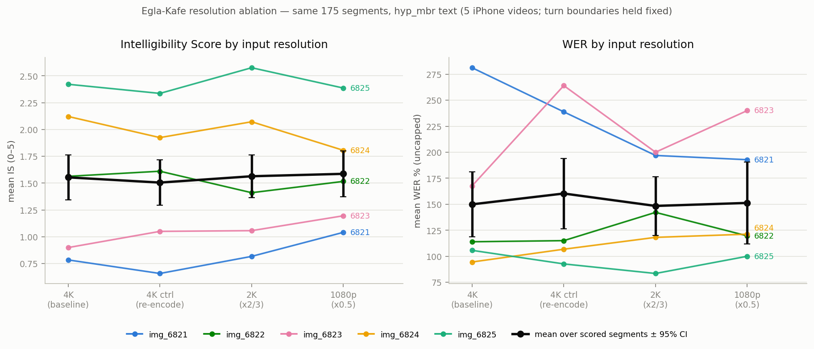
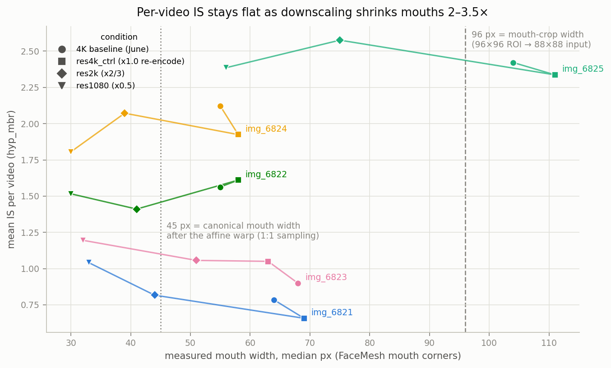

# Resolution ablation — does 4K help? does 1080p suffice? (Workstream R)

Status: **complete** (July 17, 2026). GPU sweep July 16 (3 conditions × ~60–90 min on the T4, fid
172610 each); analysis + report July 17.
Tool: `docs/_research-tools/generators/egla_kafe_resolution_compare.py` →
`resolution_ablation_stats.json` + `plots/resolution_metrics_by_condition.png` +
`plots/resolution_mouthpx_vs_delta.png`. Prep: `scripts/pipeline/egla_kafe_resolution_prep.py`.

**Verdict in one line: on this footage, input resolution is not the lever — downscaling 4K → 2K →
1080p produced no measurable quality change (all paired tests n.s.), because the pipeline
normalizes every mouth to a ~45 px canonical crop and even the 1080p mouths stay close to that
scale. Framing (mouth pixels on the sensor) and capture-chain cleanliness are the levers.**

## Design

- **Same 175 turn segments** from the 5 iPhone-4K speaker crops (img_6821–6825). The original
  run's `segments.json` was copied byte-identical (sha256-verified) → identical turn boundaries
  and utt_ids in all arms; 175/175 utt_id parity verified across all four report sets.
- **Crop-level downscale** of the 10 hand-made 1200/1300 px speaker crops (not the 4K masters):
  `ffmpeg -vf "scale=trunc(iw*F/2)*2:trunc(ih*F/2)*2:flags=lanczos" -c:v libx264 -crf 16 -preset
  slow -pix_fmt yuv420p -an`. Face detection, landmarks, affine warp, and mouth cropping **re-ran
  per condition** on the downscaled clips; all 175 segments preprocessed and decoded at every
  resolution (no face-detection dropouts down to 600 px frames).
- **Encode-generation control**: `res4k_ctrl` applies the identical ffmpeg chain at scale 1.0
  (including 10-bit → 8-bit), so baseline↔ctrl isolates the re-encode penalty and ctrl↔res2k/1080
  isolates pure resolution.
- Decode config identical everywhere (beam=20, `VSP_NBEST=1`, golden k-means; decode_params
  identical across conditions except timestamp).
- **Primary metrics on the `hyp_mbr` displayed text** (production default since May 2026), scored
  with the standard machinery (`make_report.py --compute-is --aggregated … --display-method
  hyp_mbr` on each arm's `hypo-corrected.json`). Top-1 reported as secondary; the top-1 baseline
  row reproduces the June findings numbers exactly (IS 1.51, useful 29%, clear 13.7%, WER 155%).

| arm | input | crop frames | mouth px (median, per video) |
|---|---|---|---|
| baseline | original June-24 4K decode | 1200/1300 px, 10-bit | 55–68; **img_6825 104** |
| res4k_ctrl | ×1.0 re-encode | 1200/1300 px, 8-bit | 58–69; **img_6825 111** |
| res2k | ×2/3 | 800/866 px | 39–51; img_6825 75 |
| res1080 | ×0.5 | 600/650 px | 30–33; img_6825 56 |

## Results — arms (n = 175 segments each; means over scored rows)

**hyp_mbr (primary):**

| arm | n scored | IS mean [95% CI] | WER % | useful (IS≥2) | clear (IS≥3) | halluc (WER≥100) | mean word prob | align conf |
|---|---|---|---|---|---|---|---|---|
| 4K baseline (June) | 153 | **1.554** [1.34, 1.76] | 149.9 | 27.5% | 15.7% | 62.1% | 0.408 | 0.219 |
| res4k_ctrl (×1.0) | 153 | **1.505** [1.29, 1.72] | 160.3 | 28.8% | 14.4% | 63.4% | 0.396 | 0.220 |
| res2k (×2/3) | 148 | **1.564** [1.36, 1.76] | 148.4 | 31.8% | 14.2% | 62.8% | 0.400 | 0.215 |
| res1080 (×0.5) | 144 | **1.586** [1.37, 1.80] | 151.3 | 30.6% | 14.6% | 63.2% | 0.402 | 0.224 |

Top-1 (secondary): IS 1.506 / 1.492 / 1.590 / 1.636 — same picture. Every per-arm signal is flat:
IS, WER, useful%, clear%, hallucination rate, the model's own mean word probability (0.40 at every
resolution — it is not "less sure" at 1080p), and alignment confidence. The only mild degradation
signal anywhere is the count of turns the script aligner could anchor: 153 → 153 → 148 → 144
scored rows (unmatched turns 22/22/27/31).

## Paired per-segment tests (Wilcoxon signed-rank, hyp_mbr)

| pair | ΔIS mean (median) | p | ΔWER mean | p | text changed | ref shift |
|---|---|---|---|---|---|---|
| baseline → res4k_ctrl | −0.067 (0.00) | 0.085 | +11.9 | 0.55 | 76.6% | 37.1% |
| res4k_ctrl → res2k | +0.030 (0.00) | 0.54 | −7.1 | 0.89 | 80.0% | 37.1% |
| res4k_ctrl → res1080 | +0.025 (0.00) | 0.64 | +5.0 | 0.55 | 84.0% | 37.1% |
| res2k → res1080 | −0.019 (0.00) | 0.75 | +13.7 | 0.73 | 77.7% | 35.4% |

No pair is significant on IS or WER (top-1 basis agrees, all p ≥ 0.41). The largest effect in the
whole sweep is the **encode-generation trend** (baseline→ctrl, −0.067 IS, p = 0.085, n.s.) — i.e.,
a second lossy encode costs as much as, or more than, throwing away three quarters of the pixels.

**Fixed-reference sensitivity** (refs can shift between arms because the script aligner anchors on
each arm's own decode — 35–37% of rows; see limitations): re-scoring every arm's MBR text against
the *June baseline* references gives WER 149.9 / 150.0 / 141.3 / 139.1 — if anything directionally
*lower* at lower resolutions, all pairs n.s. (p ≥ 0.25). Conclusions are not an alignment artifact.

**Output text is chaotic; output quality is not.** 74–84% of segments change their exact text
between any two arms — including 76.6% under a pure re-encode at identical resolution. The decode
is butterfly-sensitive to pixel-level perturbation while its aggregate quality stays fixed.
Stability concentrates where quality is: of ctrl's clear segments (IS ≥ 3), 45–55% survive
verbatim in the other arms, vs 10–16% of weak segments (IS < 2). The clean wins are stable — e.g.
img_6825's "that's a good point", "how many do we have", "how bad", "again" decode **identically
at 4K and at 1080p**.

## Per-video breakdown (hyp_mbr, mean IS @ measured mouth px)

| video | native 4K | res4k_ctrl | res2k | res1080 | ctrl→1080 ΔIS | context Y+P (June rank) |
|---|---|---|---|---|---|---|
| img_6821 (mustache) | 0.78 @ 64px | 0.66 @ 69px | 0.82 @ 44px | 1.04 @ 33px | +0.38 | 19.0% |
| img_6822 | 1.56 @ 55px | 1.61 @ 58px | 1.41 @ 41px | 1.52 @ 30px | −0.10 | 35.3% |
| img_6823 (mustache) | 0.90 @ 68px | 1.05 @ 63px | 1.06 @ 51px | 1.20 @ 32px | +0.15 | 14.8% |
| img_6824 | 2.12 @ 55px | 1.92 @ 58px | 2.07 @ 39px | 1.81 @ 30px | −0.12 | 66.7% |
| **img_6825** | **2.42 @ 104px** | **2.34 @ 111px** | **2.58 @ 75px** | **2.39 @ 56px** | **+0.05** | **72.7%** |

Faces (median px, ctrl → res1080): img_6821 193→96, img_6822 178→90, img_6823 178→90,
img_6824 152→77, **img_6825 303→153**.

- **img_6825 — the only video whose mouth is ≥ 96 px at 4K — does not degrade when it drops below
  that (75 px at 2K, 56 px at 1080p): ΔIS(ctrl→1080) = +0.05.** Nothing crosses a cliff.
- ΔIS(ctrl→1080) vs ctrl mouth px: Pearson r = +0.14 (p = 0.82), n = 5 — no "bigger mouths lose
  more" (or less) pattern. Degradation is uniform, i.e. absent.
- img_6821's +0.38 "improvement" at 1080p is floor noise on the worst video, not signal.

**Does mouth px explain the June per-video ranking?** No — not within the 55–68 px band.
Native-4K mouth px vs context Y+P: Spearman ρ = +0.05 (p = 0.94), Pearson r = +0.45 (p = 0.45),
n = 5. img_6824 is the second-best video with the *smallest* mouth (55 px); img_6823 has the
third-largest mouth and ranks worst. The two worn-mustache scenes rank last regardless of mouth
size — scene difficulty and facial-hair occlusion dominate. The one real mouth-px signal is the
standout: img_6825's mouth is ~2× everyone else's (subject closest to camera) and it is the
strongest video at **every** resolution — its 1080p IS (2.39) beats every other video at native
4K. Descriptive only, n = 5, content confounded (single-speaker military scene).

## Mechanism — why resolution doesn't move the needle here

The preprocessing pipeline affine-warps every face to a canonical mean-face geometry
(`20words_mean_face.npy`) and then cuts a fixed **96×96** patch around the mouth landmarks
(→ 88×88 grayscale model input). In that canonical space the mouth-corner width is **~45 px** for
an average face. So:

1. Source resolution never changes the mouth's size at the model input — the warp normalizes it.
   It only changes how much genuine optical detail survives the resampling.
2. At native 4K, 4/5 videos already carry only 55–69 px mouths (the frames are 4K; the *mouths*
   are not) — mildly **downsampled** into the 45 px canonical scale. At 1080p they are 30–33 px —
   mildly **upsampled** (~1.4×). That regime change is exactly what this sweep tested, and it
   costs nothing measurable at n = 175/arm.
3. The distance-to-camera lever is ~2× (img_6825 face ~300 px vs ~150–190 px for the rest) —
   larger than the entire 4K→1080p sweep's effect on any video.

**Reinterpreting the June iPhone-vs-camera gap (IS 1.51 vs 0.88, p = 2.3e-05).** The client-camera
files are viewer-app *screen recordings* (380–440 px frames, mouths 20–40 px, triple-encoded, UI
chrome in-frame — see findings.md file forensics). Our res1080 arm has *overlapping mouth sizes*
(30–56 px) from clean optics and scores IS 1.59 — essentially the full iPhone level, and far above
the screen-recs' 0.88. Pixel count alone therefore does **not** explain the camera gap; the
capture chain (screen-record generational loss, compression, scaling artifacts) is the dominant
factor. Cross-dataset comparison (different takes/speakers) — suggestive, not a controlled proof.

## Client-facing answer

**Does 4K help? Not by itself. Does 1080p suffice? Yes — for well-framed, cleanly-delivered
footage.** On identical segments, 4K vs 2K vs 1080p made no measurable difference on any metric
(IS, WER, useful%, entity capture, model confidence), because the recognizer reads a normalized
~45 px-wide mouth crop no matter how many pixels the camera provides. What actually matters, in
order: (1) **how large the mouth is in the frame** — frame subjects so the mouth spans at least
~50 px, comfortably ≥ 100 px (img_6825, the closest-framed video, is the strongest at every
resolution; its 1080p beats the other videos' native 4K); (2) **original files, not screen
recordings** — the June "camera" footage failed at IS 0.88 not because of its resolution number
but because 20–40 px mouths went through a screen-record chain; our clean 1080p with the same
mouth sizes scored 1.59; (3) resolution last — a 4K sensor buys *cropping/zoom headroom* to
achieve (1), not direct model gains. Practically: a 1080p camera with the subject framed
chest-up, frontal, with original exports, beats a 4K wide shot every time.

## Limitations

- **Turn segmentation and speaker assignment held fixed** (copied from the original run) — by
  design, to keep the comparison paired. A production run on true low-res capture would also have
  to re-detect turns; that path is untested here. Face detection/landmarks *were* re-run per
  condition and did not fail down to 600 px frames.
- **Single decode per condition.** Beam search is deterministic, so there is no seed variance; the
  baseline↔ctrl re-encode pair serves as the empirical noise floor (76.6% text churn, ΔIS −0.067
  n.s.) — the resolution deltas sit inside it.
- **Crop-level downscale from pristine masters** models pixel count only — not the sensor noise,
  optics, or codec of a real 1080p camera (a real 1080p capture would be somewhat worse than our
  lanczos+CRF16 downscale; conversely it tests exactly the "same camera, lower setting" question).
- **References are decode-anchored** (monotonic script aligner) — refs shift on 35–37% of rows
  between arms and 22–31 turns/arm get no reference (scored-row counts differ). Arm means are
  robust to this (the aligner redistributes the same script lines within a video) and the
  fixed-reference WER check reproduces the conclusions.
- **Scripted two-person dialogue, 5 videos, one speaker pool** — per-video correlations are n = 5
  and content-confounded; no causal claims. Mouth-px medians are FaceMesh estimates on sampled
  frames.

## Reproduce

```bash
# condition trees (prep manifests incl. per-file ffprobe + run records):
#   /home/ubuntu/datasets/clients/egla_kafe_resolution/{res4k_ctrl,res2k,res1080}/
# archives: flat_runs_archive/{20260716_185819,20260716_202731,20260716_213309}  (baseline: 20260624_200135)
/home/ubuntu/vsp-llm-yoad-venv/bin/python \
  docs/_research-tools/generators/egla_kafe_resolution_compare.py
# regenerates missing report_mbr/ per arm, writes resolution_ablation_stats.json + both plots
```




