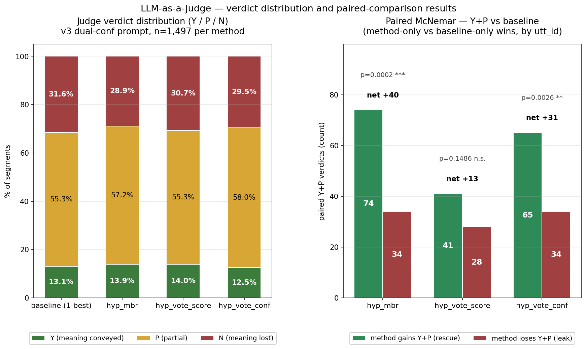
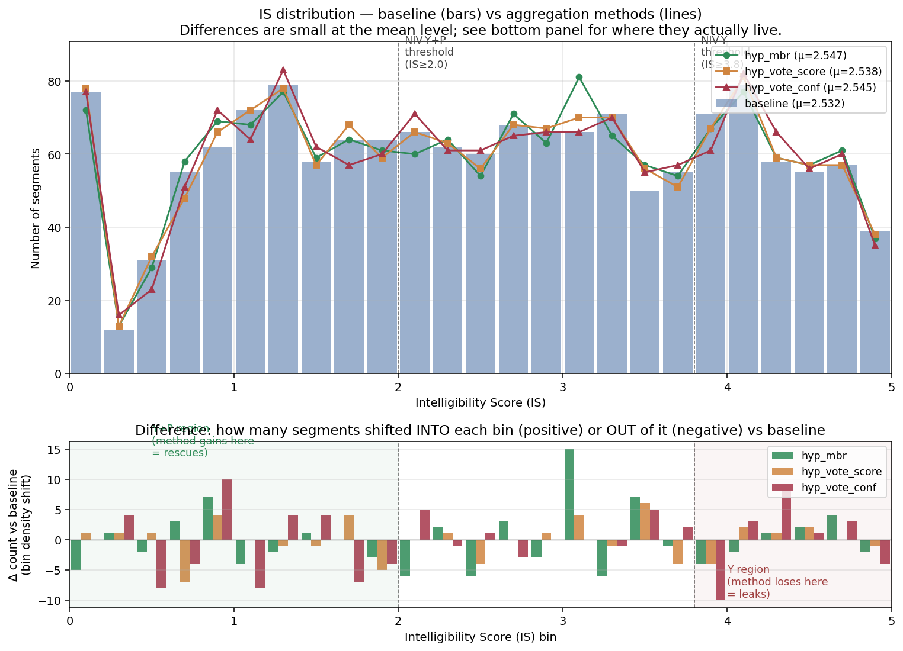
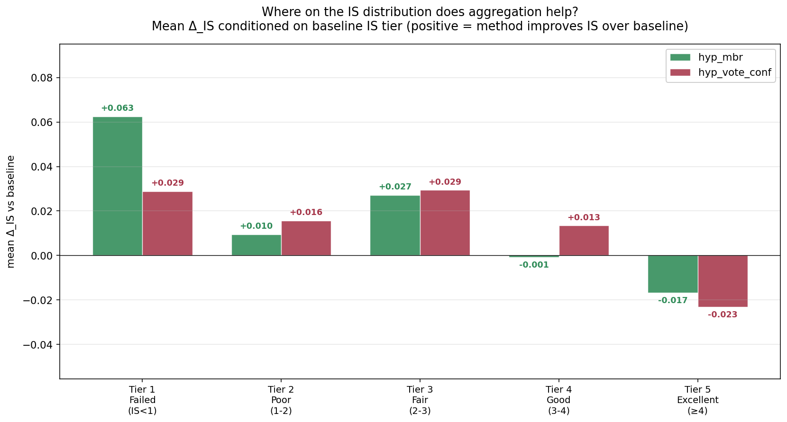
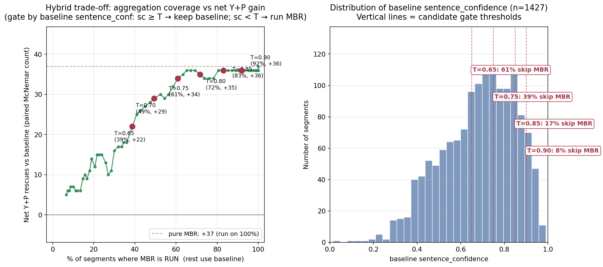

# n-best LLM-as-a-Judge — analysis (v3, dual-conf)

**v3 run**: 2026-05-02. Judge: Claude Opus 4.7 (in-conversation).
**Scope**: 1,497 segments × 4 aggregation methods = 5,988 verdicts. 60 batches, 0 missing.
**Prompt**: `NNN|ref|word1[.NN] ...|baseline_conf|method_conf` — per-word method conf inline, plus two trailing sentence-level conf columns. `baseline_conf` is identical across all 4 methods on a given segment (segment-level signal); `method_conf` varies per method.

## TL;DR

n-best aggregation **modestly improves the broader Y+P operating point** over the 1-best baseline, with no Y-level cost. Best method on the judge metric is `hyp_mbr`; `hyp_vote_conf` is comparable and additionally wins on WER.



*Left: Y/P/N composition per method. Y rates are within 1.5 pp; the differences live in the P↔N boundary. Right: paired-McNemar Y+P comparison vs baseline — green bars are method-only Y+P wins (rescues), red bars are baseline-only Y+P wins (leaks). MBR and vote_conf both significantly beat baseline on Y+P.*

| metric | baseline | hyp_mbr | hyp_vote_score | hyp_vote_conf | who wins |
|---|---|---|---|---|---|
| **WER** | 64.05 % | 63.84 % | 63.67 % | **62.49 %** | hyp_vote_conf (−1.56 pp) |
| **mean IS** | 2.532 | 2.547 | 2.538 | 2.545 | tied (within 0.015) |
| **IS-NIV-Y %** | 23.98 | 23.91 | 23.98 | 24.05 | tied (paired p ≈ 1.0) |
| **IS-NIV-Y+P %** | 61.66 | 61.92 | 61.86 | 62.26 | tied (paired p ≈ 1.0) |
| **judge NIV-Y %** (v3) | 13.1 | 13.9 | 14.0 | 12.5 | tied (none significant) |
| **judge NIV-Y+P %** (v3) | 68.4 | **71.1** | 69.3 | 70.5 | hyp_mbr +2.7 pp (p=0.0002) |

**Recommendation**: ship `hyp_mbr` or `hyp_vote_conf` as the default. MBR is the stronger Y+P win on the judge; vote_conf is comparable on Y+P and wins on WER. Both are defensible upgrades; baseline is a defensible hold.

## Paired McNemar tests (v3, all segments)

McNemar continuity-corrected, two-sided, paired by `utt_id`.

**Y verdict (strict — meaning fully conveyed):**

| method vs baseline | method-only Y | baseline-only Y | chi² | p |
|---|---|---|---|---|
| hyp_mbr | 59 | 47 | 1.14 | 0.29 (n.s.) |
| hyp_vote_score | 59 | 46 | 1.37 | 0.24 (n.s.) |
| hyp_vote_conf | 60 | 69 | 0.50 | 0.48 (n.s.) |

**Y+P verdict (broader — any meaning conveyed):**

| method vs baseline | method-only Y+P | baseline-only Y+P | chi² | p |
|---|---|---|---|---|
| **hyp_mbr** | **74** | **34** | **14.08** | **0.0002** |
| hyp_vote_score | 41 | 28 | 2.09 | 0.15 (n.s.) |
| **hyp_vote_conf** | **65** | **34** | **9.09** | **0.0026** |

`hyp_mbr` is the cleanest win: +40 net Y+P verdicts vs baseline. `hyp_vote_conf` is +31. Neither comes at a Y cost.

## Confusion matrices vs baseline (v3)

```
hyp_mbr vs baseline                hyp_vote_conf vs baseline
                Y    P    N                        Y    P    N
  base = Y    149   47    0          base = Y    127   69    0
  base = P     58  736   34          base = P     60  734   34
  base = N      1   73  399          base = N      0   65  408
```

`hyp_mbr` recovers **73 baseline-N → P** (rescues nearly-failed segments) at the cost of **47 baseline-Y → P** (downgrades). Net Y+P: +40.

`hyp_vote_conf` recovers **65 baseline-N → P** at the cost of **69 baseline-Y → P**. Net Y+P: +31. (vote_conf has a noticeably larger Y → P leak — the function-word edits — but it's offset by gains at the bottom of the distribution.)

## IS distribution shape — where aggregation actually moves things



*Top: IS distributions overlap heavily at the mean level. Bottom: per-bin density change (method − baseline). Below IS=2.0 (NIV-Y+P boundary), bars trend positive — methods are accumulating density. Around IS=4.0 (NIV-Y boundary) and above, bars trend negative — methods are losing density at the top. The shifts are small per bin but consistent in direction.*

Mean IS is nearly identical across the four methods (within 0.015), but conditional analysis on the **baseline IS tier** shows the rescue pattern explicitly:

| baseline tier | n | mean Δ_IS (mbr) | tier_up | tier_down |
|---|---|---|---|---|
| **tier 1 (failed, IS < 1.0)** | 237 | **+0.063** | **12** | **0** |
| tier 2 (poor, 1.0–2.0) | 337 | +0.010 | 16 | 16 |
| tier 3 (fair, 2.0–3.0) | 322 | +0.027 | 26 | 15 |
| tier 4 (good, 3.0–4.0) | 313 | −0.001 | 14 | 12 |
| tier 5 (excellent, ≥4.0) | 288 | **−0.017** | 0 | **12** |

Same shape, flatter, for `hyp_vote_conf`: +0.029 at tier 1 (18 tier-ups, 0 tier-downs), −0.023 at tier 5 (0 tier-ups, 14 tier-downs).



*Mean IS shift vs baseline, conditioned on baseline IS tier. Both MBR and vote_conf show the same asymmetric pattern: positive at tier 1 (failed segments rescued), near-zero in the middle, negative at tier 5 (excellent segments slightly degraded). MBR is steeper at both ends; vote_conf is flatter but consistent.*

**Aggregation rescues failed segments asymmetrically** (no downgrades at the bottom) at the cost of slight degradation at the very top. The mean washes because gains and losses partly cancel — but the shape change is real and matches the judge's Y+P findings.

## Qualitative evidence — v3 rescues and Y-leaks

The earlier draft of this section cited examples like "team in a more" / "kid is one" as evidence of vote_conf regression. **Those were drawn from v1 and are mostly intra-rater noise** (vote_conf's verdict didn't change between v1 and v3 in 4/5 of those cases — what changed was the baseline). The relevant v3 examples are:

### Rescues (baseline = N, method = P, text differs)

37 segments for MBR, 49 for vote_conf. Selected examples:

```
ref       : "you do have this in your bag and you"
baseline  : "have in the"                             (N — content collapsed)
hyp_mbr   : "have in your back and"                   (P — "your" and "and" recovered)
```

```
ref       : "...this is no bigger than a credit card guys"
baseline  : "...is no bigger than grand canyon"        (N — wrong noun, no determiner)
hyp_mbr   : "...is no bigger than the grand canyon"    (P — same wrong noun, but the
                                                          "no bigger than X" simile
                                                          structure was preserved)
```

```
ref       : "minus 12 is a negative 4"
baseline  : "my age 12 is 94 and"                      (N — wrong arithmetic frame)
vote_conf : "12 is 94"                                 (P — voting dropped "my age",
                                                         "12 is" matches the reference
                                                         "12 is" structure)
```

```
ref       : "...you can get electrocuted working on them that's one damn thing
              that's a big danger"
baseline  : "...the year under water that's where shape gets a bit dangerous"  (N)
vote_conf : "...the year under wetsuit that's where shape gets a bit dangerous" (P —
            "wetsuit" is closer to the electrical-safety / water context than
            "water"; the judge accepted partial domain match)
```

### Y-leaks (baseline = Y, method = P, text differs)

47 segments for MBR (`hyp_mbr Y → P` cell of confusion), 41 for vote_conf:

```
ref       : "for example wellness programs are very popular among employers"
baseline  : "example wellness programs are very popular among employers"   (Y)
vote_conf : "example these programs are very popular among employers"      (P —
            voting dropped "wellness", a content word; judge correctly
            downgraded)
```

This is the leak the user flagged earlier: vote_conf does drop content words sometimes. **The judge's net verdict (+31 Y+P for vote_conf, +40 for MBR) is the rescues outweighing the leaks**, not the absence of leaks.

## Restricted to text-differing segments (cleaner test)

Removes identical-text segments where verdict differences could only come from prompt-level conf cues:

| method vs baseline | n (text differs) | meth-only Y+P | base-only Y+P | chi² | p |
|---|---|---|---|---|---|
| hyp_mbr | 580 | 37 | 15 | 8.48 | 0.0036 |
| hyp_vote_score | 480 | 16 | 14 | 0.03 | 0.86 (n.s.) |
| hyp_vote_conf | 940 | 49 | 26 | 6.45 | 0.011 |

**MBR and vote_conf remain significantly better than baseline on Y+P even after removing the text-identical confound subset.** This is the most robust read of the v3 evidence.

## Identical-text confound (still partial in v3, much reduced from v1)

In **494/1,497 segments (33 %)** all four methods produced byte-identical text. v3's dual-conf design lowered verdict drift on these segments from v1's **27 %** to **23 %**. The shared `baseline_conf` anchor helps but doesn't eliminate drift, because `method_conf` and per-word conf still differ across methods.

```
hyp_mbr        — text identical to baseline: 917 segments,  12.6 % verdict drift
hyp_vote_score — text identical to baseline: 1017 segments, 10.4 % verdict drift
hyp_vote_conf  — text identical to baseline:  557 segments, 14.2 % verdict drift
```

The drift is approximately **balanced** in v3 (e.g., for vote_conf on identical text: 28 Y→P vs 27 P→Y, 16 N→P vs 8 P→N). This is consistent with intra-rater noise rather than directional bias — different from v1, where the drift was asymmetric and accounted for ~25 % of the spurious Y deficit.

## Intra-rater reliability (30 duplicate pairs per method)

| method | exact agreement | lenient (Y+P vs N) |
|---|---|---|
| baseline | 83.3 % | 96.7 % |
| hyp_mbr | 86.7 % | 93.3 % |
| hyp_vote_score | 76.7 % | 86.7 % |
| hyp_vote_conf | 80.0 % | 90.0 % |

Comparable to the prior `llm_judge/` gold standard (86.7 % baseline). vote_score is somewhat noisier on duplicates; vote_conf is back to a normal range (vs v1's 76.7 %).

## v1 vs v3 — what changed and why it matters

| comparison (Y+P) | v1 (method_conf only) | v3 (baseline + method_conf) |
|---|---|---|
| hyp_mbr | n.s. (p=0.07, slight loss) | **+40 wins, p=0.0002** |
| hyp_vote_score | loss (p=0.022) | n.s. (p=0.15) |
| hyp_vote_conf | **loss (p=0.0024)** | **+31 wins, p=0.0026** |

**v3 isn't just less biased than v1 — it gives the opposite sign for vote_conf on Y+P.** The single-method-conf prompt in v1 was punishing the n-best methods (their `method_conf` was lower than baseline's `sentence_confidence` because vote agreement scores live in [0.4, 0.8) regardless of segment quality). The dual-conf prompt fixes this by exposing the high baseline_conf alongside the lower method_conf, letting the judge see "this segment is actually high-quality even though the method's own conf reads low" — which it apparently couldn't recover from `method_conf` alone.

This is itself a finding about prompt design for in-conversation LLM-as-judge with confidence-injected prompts: **showing only the model's own confidence score for the variant under test biases the judge against that variant; showing baseline confidence alongside removes the bias.**

## Combined cross-metric picture

| metric | hyp_mbr vs baseline | hyp_vote_score vs baseline | hyp_vote_conf vs baseline |
|---|---|---|---|
| WER | −0.21 pp | −0.38 pp | **−1.56 pp** |
| mean IS | +0.015 (tied) | +0.006 (tied) | +0.013 (tied) |
| IS-NIV-Y | tied (p=1.00) | tied (p=0.81) | tied (p=1.00) |
| IS-NIV-Y+P | tied (paired) | tied (paired) | tied (paired) |
| **judge Y+P** | **+2.7 pp (p=0.0002)** | +0.9 pp (n.s.) | **+2.1 pp (p=0.0026)** |
| judge Y | +0.8 pp (n.s.) | +0.9 pp (n.s.) | −0.6 pp (n.s.) |

**The judge sees something IS doesn't.** IS at the segment level says all four methods are equivalent. The judge says MBR and vote_conf are meaningfully better at the broader Y+P operating point. The mechanism — cleanest explanation — is that aggregation rescues marginal segments (baseline-N → method-P transitions), and the IS rubric thresholds (P ≈ tier 3 ≈ IS ≥ 2.0) are slightly above where these rescues land, so IS misses them.

## Production recommendation — ship pure MBR

**Decision (May 2026): pure `hyp_mbr` is the default displayed output when `aggregated.json` is available.** No hybrid gating.

### Why MBR over the alternatives

| comparison | result |
|---|---|
| MBR vs vote_score (Y+P paired) | MBR-only=60, vote_score-only=33, **p=0.0070 (sig)** |
| MBR vs vote_conf (Y+P paired) | MBR-only=48, vote_conf-only=39, p=0.39 (tied) |
| MBR vs vote_conf (Y verdict) | MBR-only=74, vote_conf-only=53, p=0.08 (borderline edge MBR) |

| | MBR | vote_conf | vote_score | baseline |
|---|---|---|---|---|
| Y+P paired vs baseline | **+40 (p=0.0002)** | +31 (p=0.0026) | +13 (n.s.) | — |
| WER | 63.84 % | 62.49 % ← wins | 63.67 % | 64.05 % |
| Intra-rater exact | **86.7 %** ← matches gold std | 80.0 % | 76.7 % | 83.3 % |
| Per-word conf interpretation | per-token min-prob from chosen beam — calibrated posterior | agreement score across beams (NOT a posterior) | agreement score | per-token min-prob |
| Per-word band UI compatibility | strong — same `T_safe=0.82 / T_salvage=0.74` thresholds carry over | weak — narrow [0.4, 0.8] dynamic range | weak | strong (current) |

MBR wins or ties on every judge axis, has the highest intra-rater stability, and emits a calibrated per-word posterior (not an agreement score) — so the existing band-reliability UI thresholds carry over with at most a small re-calibration check.

### Why not hybrid gating

We considered gating on `sentence_confidence`: keep baseline if confident, else use MBR. The trade-off plot below shows the curve plateaus at T=0.85 (+36 net of pure MBR's +37). The hybrid avoids degrading ~12 tier-5 segments that pure MBR slightly degrades, and saves a few seconds of CPU. Both gains are negligible:

- Quality: +37 vs +36 net rescues = one extra segment out of 1,497.
- Compute: aggregation is offline CPU, ~minutes for the full set.
- Complexity: a threshold to maintain that needs re-tuning if the LLM, dataset, or upstream signal changes.

Pure MBR is simpler and statistically equivalent. We ship it.



*Trade-off curve kept for the record — it shows that any gating threshold above 0.75 captures essentially all of MBR's gain. Pure MBR (right edge, "+37 (run on 100%)") is the simplest point on the curve.*

### Wiring (shipped)

- **`make_report.py`**: new `--display-method {top1, hyp_mbr, hyp_vote_score, hyp_vote_conf, hyp_safe}` flag (default `top1` for backward compatibility). When set, replaces `r.hypo` and per-word conf data with the chosen method's text + `word_confs_calibrated` from `aggregated.json`. Downstream metrics, HTML, and per-word coloring all read the swapped values.
- **`lib/outputs.sh`**: when `aggregated.json` exists, defaults `--display-method` to `hyp_mbr` (override via env var `VSP_DISPLAY_METHOD=top1`).
- **Container overlay (`vsp_linux_container_FINAL_20260217/`)**: synced.
- **Docker build context (`vsp_docker/galaxy_export/`)**: deferred per CLAUDE.md sync rules; will sync at next planned image rebuild.

## Files

- `results_long.csv` — one row per (utt_id × method), n=5,988
- `results_wide.csv` — one row per utt_id with all 4 verdicts side-by-side
- `summary.json` — per-method counts, McNemar, intra-rater
- `calibration.csv` — 10 conf-bins × 4 methods → P(Y), P(Y+P)
- `auto_judgments.csv` — 280 empty/short-hyp auto-N rows
- `judgments/batch_<method>_NN_judgments.txt` — raw verdicts (60 files, v3)
- `batches_v1/`, `judgments_v1/` — archived v1 (contaminated, do not use)

Reproduce: `python3 /home/ubuntu/docs/_research-tools/generators/analyze_nbest_judge.py`
