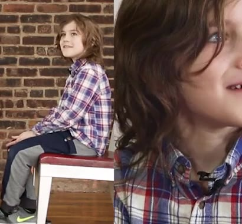
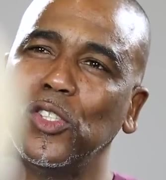
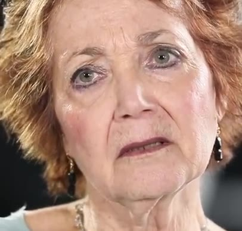

# RealTalk demo candidates — analysis vs source video

_Pipeline run report dir: `/home/ubuntu/flat_runs_archive/20260503_000805/client_outputs/report`_

_Candidates evaluated: **25** of 25 from triage._

## Aggregate

| metric | mean | median | min | max |
|---|---|---|---|---|
| WER (top-1) | 64.82 | 65.70 | 0.00 | 100.00 |
| WER (MBR) | 64.82 | 65.70 | 0.00 | 100.00 |
| IS | 2.29 | 2.72 | 0.00 | 5.00 |
| sentence_conf | 0.61 | 0.61 | 0.42 | 0.78 |

| outcome (NIV) | count | % |
|---|---|---|
| Clearly Conveyed | 5 | 20% |
| Salvage | 9 | 36% |
| Failed | 11 | 44% |
| Unknown | 0 | 0% |

## Clearly Conveyed (IS ≥ 3.80)

### 12XM5_1lyrc__p0 @ 240s
- **IS**: 5.00 (Y (clearly conveyed))  ·  **WER (top1/MBR)**: 0% / 0%  ·  **sentence_conf**: 0.756 → trust **Salvage**
- **named entities (triage)**: `God;States;United`
- **REF**: in the united states i just think that you're taking it like a trooper that you are i think
- **HYP (displayed = MBR)**: in the united states i just think that you're taking it like a trooper that you are i think
- **frames**:   
- **burned clip**: [`12XM5_1lyrc__p0__win0240__burned.mp4`](12XM5_1lyrc__p0__win0240__burned.mp4)
- **observation**: _(curator: head pose / lip visibility / speaking rate / why it succeeded/failed)_

### 7LcWBEVtGwA__p1 @ 520s
- **IS**: 4.72 (Y (clearly conveyed))  ·  **WER (top1/MBR)**: 15% / 15%  ·  **sentence_conf**: 0.742 → trust **Salvage**
- **named entities (triage)**: `God`
- **REF**: that's god too and you're the one that introduced me to god i wouldn't have a context of who god was if it wasn't for you and for that faith you have but i just want to say thank you for
- **HYP (displayed = MBR)**: that's god too when you're the one that introduced me to god like i wouldn't have a context of who god was if it wasn't for you for that faith cradle but like i just want to say thank you for
- **frames**:   
- **burned clip**: [`7LcWBEVtGwA__p1__win0520__burned.mp4`](7LcWBEVtGwA__p1__win0520__burned.mp4)
- **observation**: _(curator: head pose / lip visibility / speaking rate / why it succeeded/failed)_

### V1tcw5SLwmM__p1 @ 360s
- **IS**: 4.58 (Y (clearly conveyed))  ·  **WER (top1/MBR)**: 20% / 20%  ·  **sentence_conf**: 0.779 → trust **Salvage**
- **named entities (triage)**: `10;21;Benjamin`
- **REF**: and babies like right out of the gate i'm like this is gonna be my trap him method i'll have all of his children and it'll be perfect and we'll be together forever and so on and so forth like it was like the sexiest thing
- **HYP (displayed = MBR)**: babies like right out of the gate i'm like this is going to be my trappy method i'll have all of these children and it will be perfect and we'll be together forever and so on and so forth and it was like the sexiest thing
- **frames**:   
- **burned clip**: [`V1tcw5SLwmM__p1__win0360__burned.mp4`](V1tcw5SLwmM__p1__win0360__burned.mp4)
- **observation**: _(curator: head pose / lip visibility / speaking rate / why it succeeded/failed)_

### RfhG9O99MIY__p1 @ 230s
- **IS**: 4.38 (Y (clearly conveyed))  ·  **WER (top1/MBR)**: 28% / 28%  ·  **sentence_conf**: 0.776 → trust **Salvage**
- **named entities (triage)**: `Harlow;Jack;Toronto`
- **REF**: his music in one of my videos for real he said yes he's coming to toronto so i fly back tomorrow morning to shoot him that night yeah oh so i'm shooting him i'm shooting like his photographer yeah
- **HYP (displayed = MBR)**: music in one of my videos and he said yes he's coming to toronto so i fly back tomorrow morning to shoot him that night yeah so i was doing like his photographer and i'm
- **frames**:   
- **burned clip**: [`RfhG9O99MIY__p1__win0230__burned.mp4`](RfhG9O99MIY__p1__win0230__burned.mp4)
- **observation**: _(curator: head pose / lip visibility / speaking rate / why it succeeded/failed)_

### nvqZ0zrca4I__p1 @ 40s
- **IS**: 4.36 (Y (clearly conveyed))  ·  **WER (top1/MBR)**: 31% / 31%  ·  **sentence_conf**: 0.697 → trust **Salvage**
- **named entities (triage)**: `Canada;Cuz;Driving`
- **REF**: that i have with you okay probably driving back from canada oh my god i felt really bad because i was really angry and like grumpy
- **HYP (displayed = MBR)**: have in you i was driving back from canada oh my god i felt really bad because i was really angry and that grew into
- **frames**:   
- **burned clip**: [`nvqZ0zrca4I__p1__win0040__burned.mp4`](nvqZ0zrca4I__p1__win0040__burned.mp4)
- **observation**: _(curator: head pose / lip visibility / speaking rate / why it succeeded/failed)_

## Salvage (IS 2.00–3.79)

### nvqZ0zrca4I__p0 @ 140s
- **IS**: 3.67 (P (any useful))  ·  **WER (top1/MBR)**: 55% / 55%  ·  **sentence_conf**: 0.615 → trust **Strip**
- **named entities (triage)**: `22;You`
- **REF**: like getting older is like we're not old or anything but it's crazy as time passes we just like really can't see one another and i get scared like
- **HYP (displayed = MBR)**: getting older is crazy it's like time passes and we just get really close to one another and then get scared
- **frames**:   
- **burned clip**: [`nvqZ0zrca4I__p0__win0140__burned.mp4`](nvqZ0zrca4I__p0__win0140__burned.mp4)
- **observation**: _(curator: head pose / lip visibility / speaking rate / why it succeeded/failed)_

### MJueiM5zCxs__p0 @ 190s
- **IS**: 3.40 (P (any useful))  ·  **WER (top1/MBR)**: 48% / 48%  ·  **sentence_conf**: 0.620 → trust **Strip**
- **named entities (triage)**: `23;24`
- **REF**: my parents are the best example but i mean they dated for four weeks and they were married for 23 24 years so it's like i don't feel like
- **HYP (displayed = MBR)**: my parents got married at the age of 18 i mean they dated for four years they were married for 42 years it's like i don't know for that
- **frames**:   
- **burned clip**: [`MJueiM5zCxs__p0__win0190__burned.mp4`](MJueiM5zCxs__p0__win0190__burned.mp4)
- **observation**: _(curator: head pose / lip visibility / speaking rate / why it succeeded/failed)_

### v4yOlWUlOGM__p1 @ 130s
- **IS**: 3.36 (P (any useful))  ·  **WER (top1/MBR)**: 52% / 52%  ·  **sentence_conf**: 0.673 → trust **Salvage**
- **named entities (triage)**: `10;11`
- **REF**: i could care less i don't think about when we were 10 11 years old do i wish i had a friend with me and help me with school and you know help me get a's or just help me do better
- **HYP (displayed = MBR)**: i couldn't get this out of my mind when we were 11 and 12 years old so i wish i had a friend with me that had helped me with school and could call me at night or just tell me to
- **frames**:   
- **burned clip**: [`v4yOlWUlOGM__p1__win0130__burned.mp4`](v4yOlWUlOGM__p1__win0130__burned.mp4)
- **observation**: _(curator: head pose / lip visibility / speaking rate / why it succeeded/failed)_

### 6UmiNVjZwB0__p1 @ 200s
- **IS**: 3.02 (P (any useful))  ·  **WER (top1/MBR)**: 57% / 57%  ·  **sentence_conf**: 0.682 → trust **Salvage**
- **named entities (triage)**: `12;God`
- **REF**: ugh there could be something right around that corner i'm not gonna check like most people do in horror movies where they're like like you're knocking on the door at like 12 o'clock they check
- **HYP (displayed = MBR)**: i'm not going to do that like most people do in horror movies like either knocking on the door at 12 o'clock in the night
- **frames**:   
- **burned clip**: [`6UmiNVjZwB0__p1__win0200__burned.mp4`](6UmiNVjZwB0__p1__win0200__burned.mp4)
- **observation**: _(curator: head pose / lip visibility / speaking rate / why it succeeded/failed)_

### UnQEcquyAYI__p0 @ 70s
- **IS**: 2.94 (P (any useful))  ·  **WER (top1/MBR)**: 58% / 58%  ·  **sentence_conf**: 0.637 → trust **Strip**
- **named entities (triage)**: `2;Shane`
- **REF**: were crying it was about like unicorns and clouds but it actually works it's shame to am today you stopped crying you were able to relax so that one i do
- **HYP (displayed = MBR)**: crying it was about like you don't always have to yell but it actually works and you stop crying and you're able to relax so that will get you
- **frames**:   
- **burned clip**: [`UnQEcquyAYI__p0__win0070__burned.mp4`](UnQEcquyAYI__p0__win0070__burned.mp4)
- **observation**: _(curator: head pose / lip visibility / speaking rate / why it succeeded/failed)_

### 8i2gkAhvTvc__p1 @ 310s
- **IS**: 2.81 (P (any useful))  ·  **WER (top1/MBR)**: 66% / 66%  ·  **sentence_conf**: 0.588 → trust **Strip**
- **named entities (triage)**: `Beethoven;Boston;New;York`
- **REF**: so i really think it was a trip where you came down to boston we packed shit up and we drove to new york i made you pee in a bottle while listening to beethoven blasting and then swerved the car
- **HYP (displayed = MBR)**: so i really think it was a dream you know i came off the bus and i packed it up and i drove to new york city and i made it over and
- **frames**:   
- **burned clip**: [`8i2gkAhvTvc__p1__win0310__burned.mp4`](8i2gkAhvTvc__p1__win0310__burned.mp4)
- **observation**: _(curator: head pose / lip visibility / speaking rate / why it succeeded/failed)_

### 12XM5_1lyrc__p1 @ 300s
- **IS**: 2.80 (P (any useful))  ·  **WER (top1/MBR)**: 57% / 57%  ·  **sentence_conf**: 0.594 → trust **Strip**
- **named entities (triage)**: `Father;God;Him`
- **REF**: easy but i said he got me this far i know he gonna pull me too so i just you know just humble myself and i call upon a man and this you know i just say you know every morning i get a
- **HYP (displayed = MBR)**: easy but i said i'm in this far i know it's going to be tough so i just doubled myself when i call upon the body men that's the truth every morning i get up
- **frames**:   
- **burned clip**: [`12XM5_1lyrc__p1__win0300__burned.mp4`](12XM5_1lyrc__p1__win0300__burned.mp4)
- **observation**: _(curator: head pose / lip visibility / speaking rate / why it succeeded/failed)_

### 5M9kx6mrXrA__p0 @ 70s
- **IS**: 2.72 (P (any useful))  ·  **WER (top1/MBR)**: 44% / 44%  ·  **sentence_conf**: 0.620 → trust **Strip**
- **named entities (triage)**: `FaceTiming;Island;Long`
- **REF**: not long island which i kept thinking was long island which is dumb and there was a moment when we were on the phone or
- **HYP (displayed = MBR)**: which i kept thinking with all this and there was a moment when we were on the floor
- **frames**:   
- **burned clip**: [`5M9kx6mrXrA__p0__win0070__burned.mp4`](5M9kx6mrXrA__p0__win0070__burned.mp4)
- **observation**: _(curator: head pose / lip visibility / speaking rate / why it succeeded/failed)_

### 5M9kx6mrXrA__p0 @ 380s
- **IS**: 2.44 (P (any useful))  ·  **WER (top1/MBR)**: 66% / 66%  ·  **sentence_conf**: 0.539 → trust **Strip**
- **named entities (triage)**: `Google;Roosevelt;Theodore`
- **REF**: that's what people do they google it and it's like theodore roosevelt said this you don't know shit about theodore roosevelt you just thought this quote was like enough to convince people that you're happy
- **HYP (displayed = MBR)**: that's what people don't get cool is that i didn't think of it all like that until i started this quote was like enough to convince people that i
- **frames**:   
- **burned clip**: [`5M9kx6mrXrA__p0__win0380__burned.mp4`](5M9kx6mrXrA__p0__win0380__burned.mp4)
- **observation**: _(curator: head pose / lip visibility / speaking rate / why it succeeded/failed)_

## Failed (IS < 2.00)

### 12XM5_1lyrc__p0 @ 230s
- **IS**: 1.87 (N (not useful))  ·  **WER (top1/MBR)**: 69% / 69%  ·  **sentence_conf**: 0.608 → trust **Strip**
- **named entities (triage)**: `States;United`
- **REF**: you still have some pending legal things going on that can jeopardize your stay perhaps here
- **HYP (displayed = MBR)**: should i be submitting little things going on that gemini should say perhaps the
- **frames**:   
- **burned clip**: [`12XM5_1lyrc__p0__win0230__burned.mp4`](12XM5_1lyrc__p0__win0230__burned.mp4)
- **observation**: _(curator: head pose / lip visibility / speaking rate / why it succeeded/failed)_

### MJueiM5zCxs__p0 @ 610s
- **IS**: 1.59 (N (not useful))  ·  **WER (top1/MBR)**: 100% / 100%  ·  **sentence_conf**: 0.512 → trust **Strip**
- **named entities (triage)**: `New;York`
- **REF**: um your new york experience i think anytime i think
- **HYP (displayed = MBR)**: i don't know two years better i think the next time i take
- **frames**:   
- **burned clip**: [`MJueiM5zCxs__p0__win0610__burned.mp4`](MJueiM5zCxs__p0__win0610__burned.mp4)
- **observation**: _(curator: head pose / lip visibility / speaking rate / why it succeeded/failed)_

### MkV7LSXtzkQ__p1 @ 560s
- **IS**: 1.02 (N (not useful))  ·  **WER (top1/MBR)**: 83% / 83%  ·  **sentence_conf**: 0.459 → trust **Strip**
- **named entities (triage)**: `Marty`
- **REF**: you'd buy something and say thanks marty oh when he died yeah my dark sense of humor is there to say yeah right when are you proudest of me
- **HYP (displayed = MBR)**: when he died my daughter's tutor said to her
- **frames**:   
- **burned clip**: [`MkV7LSXtzkQ__p1__win0560__burned.mp4`](MkV7LSXtzkQ__p1__win0560__burned.mp4)
- **observation**: _(curator: head pose / lip visibility / speaking rate / why it succeeded/failed)_

### ee8Qwiu4N50__p1 @ 60s
- **IS**: 0.97 (N (not useful))  ·  **WER (top1/MBR)**: 88% / 88%  ·  **sentence_conf**: 0.520 → trust **Strip**
- **named entities (triage)**: `Jeep`
- **REF**: or i could have had a better car but when i first got the jeep instead of the jeep that situation had me off my baby midnight i miss her that's the name of my car but i mean i had to come
- **HYP (displayed = MBR)**: when i was at the gym staying in shape so my name is mikayla and i'm here but i'll
- **frames**:   
- **burned clip**: [`ee8Qwiu4N50__p1__win0060__burned.mp4`](ee8Qwiu4N50__p1__win0060__burned.mp4)
- **observation**: _(curator: head pose / lip visibility / speaking rate / why it succeeded/failed)_

### FzCjvLU7u7Q__p1 @ 550s
- **IS**: 0.71 (N (not useful))  ·  **WER (top1/MBR)**: 93% / 93%  ·  **sentence_conf**: 0.438 → trust **Strip**
- **named entities (triage)**: `Pam;Pri`
- **REF**: so i mean that's why that's one thing that i do that for you because just like you already know i don't tolerate shit with pri and she knows
- **HYP (displayed = MBR)**: so that's what i'm going to talk about today
- **frames**:   
- **burned clip**: [`FzCjvLU7u7Q__p1__win0550__burned.mp4`](FzCjvLU7u7Q__p1__win0550__burned.mp4)
- **observation**: _(curator: head pose / lip visibility / speaking rate / why it succeeded/failed)_

### v43L_FaHz28__p0 @ 390s
- **IS**: 0.65 (N (not useful))  ·  **WER (top1/MBR)**: 94% / 94%  ·  **sentence_conf**: 0.464 → trust **Strip**
- **named entities (triage)**: `City;Connecticut;New;York`
- **REF**: connecticut is such a huge thing you know like my whole life i thought i will live in new york city i will never live anywhere else i will never move back to connecticut
- **HYP (displayed = MBR)**: when i was a little girl i always wanted to be a princess
- **frames**:   
- **burned clip**: [`v43L_FaHz28__p0__win0390__burned.mp4`](v43L_FaHz28__p0__win0390__burned.mp4)
- **observation**: _(curator: head pose / lip visibility / speaking rate / why it succeeded/failed)_

### v43L_FaHz28__p1 @ 440s
- **IS**: 0.30 (N (not useful))  ·  **WER (top1/MBR)**: 97% / 97%  ·  **sentence_conf**: 0.421 → trust **Strip**
- **named entities (triage)**: `Connecticut;New;York`
- **REF**: probably the biggest deal i didn't think we'd be back here anytime soon and i kind of had resigned myself to being fine with that well you left connecticut
- **HYP (displayed = MBR)**: well you have seen anything
- **frames**:   
- **burned clip**: [`v43L_FaHz28__p1__win0440__burned.mp4`](v43L_FaHz28__p1__win0440__burned.mp4)
- **observation**: _(curator: head pose / lip visibility / speaking rate / why it succeeded/failed)_

### RfhG9O99MIY__p0 @ 210s
- **IS**: 0.00 (N (not useful))  ·  **WER (top1/MBR)**: 100% / 100%  ·  **sentence_conf**: — → trust **—**
- **named entities (triage)**: `Harlow;Internet;Jack;James`
- **REF**: you know i like there's just too many good artists out there like i can give you who i've been listening to lately okay yeah which is like i've been listening to a lot of like internet james jack harlow no way
- **HYP (displayed = MBR)**: [empty]
- **frames**:   
- **burned clip**: [`RfhG9O99MIY__p0__win0210__burned.mp4`](RfhG9O99MIY__p0__win0210__burned.mp4)
- **observation**: _(curator: head pose / lip visibility / speaking rate / why it succeeded/failed)_

### _0VwR9WPS-k__p0 @ 30s
- **IS**: 0.00 (N (not useful))  ·  **WER (top1/MBR)**: 100% / 100%  ·  **sentence_conf**: — → trust **—**
- **named entities (triage)**: `Park;Square;Washington`
- **REF**: on the bench in washington square park i was just like oh like any other person would have just been like i'm out like this is too much and we were just like
- **HYP (displayed = MBR)**: [empty]
- **frames**:   
- **burned clip**: [`_0VwR9WPS-k__p0__win0030__burned.mp4`](_0VwR9WPS-k__p0__win0030__burned.mp4)
- **observation**: _(curator: head pose / lip visibility / speaking rate / why it succeeded/failed)_

### Z2vxS15RWMU__p0 @ 90s
- **IS**: 0.00 (N (not useful))  ·  **WER (top1/MBR)**: 100% / 100%  ·  **sentence_conf**: — → trust **—**
- **named entities (triage)**: `Trevor`
- **REF**: fuckery and lies you know what i'm saying and only you can untie them cause i'm back out here i'm like yo trevor let's go come over here whoopty whoop whatever your car is in the garage i'm like trevor i got a car for you
- **HYP (displayed = MBR)**: [empty]
- **frames**:   
- **burned clip**: [`Z2vxS15RWMU__p0__win0090__burned.mp4`](Z2vxS15RWMU__p0__win0090__burned.mp4)
- **observation**: _(curator: head pose / lip visibility / speaking rate / why it succeeded/failed)_

### Z2vxS15RWMU__p0 @ 320s
- **IS**: 0.00 (N (not useful))  ·  **WER (top1/MBR)**: 100% / 100%  ·  **sentence_conf**: — → trust **—**
- **named entities (triage)**: `Trevor`
- **REF**: not their selves so you can't deal with that person as if oh that's trevor no that's trevor on drugs you can't deal with you know you understand what i'm saying he loves you
- **HYP (displayed = MBR)**: [empty]
- **frames**:   
- **burned clip**: [`Z2vxS15RWMU__p0__win0320__burned.mp4`](Z2vxS15RWMU__p0__win0320__burned.mp4)
- **observation**: _(curator: head pose / lip visibility / speaking rate / why it succeeded/failed)_
